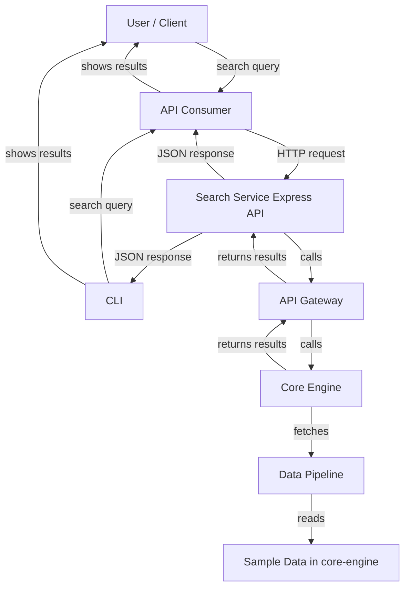

# Search Service Monorepo: Brief Explanation & Use Case Diagram

## Overview
This monorepo implements a modular, production-ready e-commerce search system. It supports searching across multiple domains such as products, categories, and editorial content, and is structured for scalability and maintainability using TypeScript and Node.js.

## Structure
- **apps/search-service**: Express API exposing `/search` and `/search/autocomplete` endpoints.
- **apps/search-cli**: Developer CLI for querying the search engine.
- **packages/core-engine**: Core search logic, domain models, and in-memory data.
- **packages/data-pipeline**: Ingestion helpers and repository logic.
- **packages/api-gateway**: HTTP composition layer.
- **packages/ux-experience**: User experience and presentation logic.
- **docs/**: Documentation and diagrams.

## Use Case Diagram

## Example Endpoints
- `GET /search?q=your-query` — Full search
- `GET /search/autocomplete?q=partial` — Autocomplete suggestions

## How it works
1. User or CLI sends a search request to the API.
2. The API Gateway composes the request and calls the core search engine.
3. The core engine queries the in-memory repository (populated from seed data).
4. Results are returned to the user as JSON.

---

For more details, see the individual package READMEs and the main `README.md`.
